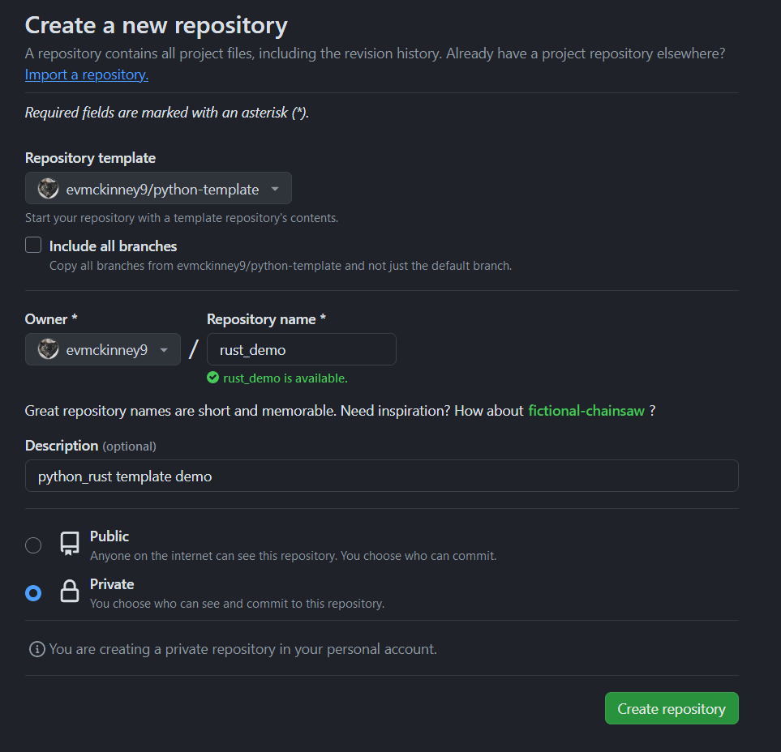

The goal of this post is to document the updates I made to my Python project template to **support creation of packages with Rust extensions that are installable via pip, without the need for a Rust compiler on the installation target**. Utilizing GitHub Actions and `cibuildwheel`, I automate the creation of wheels across multiple platforms. 

Everything that follows has been implemented in my [Python project template](https://github.com/evmckinney9/python-template).

___

- **GitHub Actions**: Automates workflows, enabling CI/CD for project builds and tests. Learn more through [GitHub-hosted runners](https://docs.github.com/en/actions/using-github-hosted-runners/about-github-hosted-runners) and [building/testing Python](https://docs.github.com/en/actions/automating-builds-and-tests/building-and-testing-python).

- **Learning Rust**: Improve your Rust knowledge with the [Rust Book](https://doc.rust-lang.org/stable/book/) and [Comprehensive Rust by Google](https://google.github.io/comprehensive-rust/). Practice with [Rustlings exercises](https://github.com/rust-lang/rustlings), and explore resources like [Awesome Rust](https://github.com/rust-unofficial/awesome-rust) and [Rust Algorithms](https://github.com/TheAlgorithms/Rust).

- **Rust and Python Integration**: Utilize [PyO3](https://pyo3.rs) for creating Python bindings for Rust code. [Maturin](https://www.maturin.rs/) is a popular tool for building Python packages from Rust extensions, although not used in this project. 
  - [`setuptools-rust`](https://github.com/PyO3/setuptools-rust) is an add-on for `setuptools` which is more flexibile but requires more configuration than `maturin`.
  - [Qiskit Accelerate](https://github.com/Qiskit/qiskit/tree/main/crates/accelerate), alongside its [performance insights](https://medium.com/qiskit/new-weve-started-using-rust-in-qiskit-for-better-performance-a3676433ca8c), illustrates the benefits of Rust and Python integration in a production environment.

___

# Setup Python with Rust

Start with an existing Python project template. In the next steps I used [PyO3's documentation](https://pyo3.rs) for instructions on wrapping Rust for Python, with the [setuptools-rust starter](https://github.com/PyO3/pyo3/tree/main/examples/setuptools-rust-starter) as a helpful resource.

## Modify Package Structure

1. **Update `pyproject.toml`**: Add `"setuptools-rust"` to the build system requirements, enabling Rust extension builds within your Python project. For detailed guidance, consult the [Setuptools Rust documentation](https://setuptools-rust.readthedocs.io/en/latest/).

    ```toml
    [build-system]
    requires = ["setuptools", "wheel", "setuptools-rust"]
    build-backend = "setuptools.build_meta"
    ```

    Also, define Rust extension modules here, as detailed in the [`RustExtension` API documentation](https://setuptools-rust.readthedocs.io/en/latest/reference.html).

    ```toml
    [[tool.setuptools-rust.ext-modules]]
    target = "{{project_name}}._accelerate"
    path = "crates/Cargo.toml"
    binding = "PyO3"
    ```

2. **Revise `MANIFEST.in`**: Update this file to include Rust source files in the package, ensuring a comprehensive package build. Guidance on which files to include can be found in this [Setuptools documentation](https://setuptools.pypa.io/en/latest/userguide/miscellaneous.html).

    ```ini
    include pyproject.toml
    include crates/Cargo.toml
    recursive-include crates *.rs
    recursive-include src *
    ```

3. **Detail `crates/Cargo.toml`**: This file specifies the Rust package's name, version, and dependencies. PyO3's inclusion facilitates Python bindings, as outlined in the [Cargo manifest format](https://doc.rust-lang.org/cargo/reference/manifest.html).

    ```toml
    [package]
    name = "{{project_name}}_accelerate"
    version = "0.1.0"
    edition = "2021"
    
    [lib]
    name = "{{project_name}}_accelerate"
    crate-type = ["cdylib"]
    path = "src/lib.rs"
    
    [dependencies.pyo3]
    version = "0.20.3"
    features = ["extension-module"]
    ```

## Define the Rust Functions
The process of integrating Rust functions into your Python project involves a few key steps:

1. **Implement Rust Functions**: Start by defining the Rust functions in `crates/src/basic_functions/basic_math.rs`. USe PyO3's `#[pyfunction]` attribute to ensure these functions are callable from Python.

    For example, to add and subtract in Rust:

    ```rust
    // crates/src/basic_functions/basic_math.rs
    use pyo3::prelude::*;

    #[pyfunction]
    #[pyo3(text_signature = "(a, b, /)")]
    pub fn add_in_rust(a: i32, b: i32) -> PyResult<i32> {
        Ok(a + b)
    }

    #[pyfunction]
    #[pyo3(text_signature = "(a, b, /)")]
    pub fn subtract_in_rust(a: i32, b: i32) -> PyResult<i32> {
        Ok(a - b)
    }
    ```

2. **Package Rust Functions into Modules**: Next, organize these functions into a module using `mod.rs`. This step groups your Rust functions logically, making them easier to manage and call from Python.

    ```rust
    // crates/src/basic_functions/mod.rs
    pub mod basic_math;
    pub mod basic_strings;

    use pyo3::prelude::*;

    #[pymodule]
    pub fn basic_functions(_py: Python, m: &PyModule) -> PyResult<()> {
        m.add_wrapped(wrap_pyfunction!(basic_math::add_in_rust))?;
        m.add_wrapped(wrap_pyfunction!(basic_math::subtract_in_rust))?;
        m.add_wrapped(wrap_pyfunction!(basic_strings::concat_in_rust))?;
        Ok(())
    }
    ```

3. **Expose Rust Modules to Python**: Finally, use `lib.rs` to expose the newly created modules to Python. This step ensures that the Rust-written functions are accessible within your Python environment.

    ```rust
    // crates/src/lib.rs

    use pyo3::prelude::*;
    use pyo3::wrap_pymodule;

    mod basic_functions;

    #[pymodule]
    fn _accelerate(_py: Python<'_>, m: &PyModule) -> PyResult<()> {
        m.add_wrapped(wrap_pymodule!(basic_functions::basic_functions))?;
        Ok(())
    }
    ```

## Testing the Template

Verifying the integration involves a straightforward process:

1. **Instantiate and Build**: After setting up the template and implementing the Rust functions, create a new repository from the template and clone it to your development environment. I am using Ubuntu in WSL2, with Rust already installed.

      

2. **Build and Test**: Use the `make init` command to establish a virtual environment, install the project with all dependencies, and run tests to ensure successful integration.

    ```{.bash code-line-numbers="false"}
    evmck@Desktop ~/template_demo
    $ make init
    ```

    Successful execution and interaction with the package methods can be confirmed in a Jupyter notebook, indicating the Rust functions are callable from Python.

    

::: {.callout-important}
Unsuprisingly, attempting to install the package on an environment without Rust results in a build failure.

```{.bash code-line-numbers="false"}
evmck@Evan-Desktop ~/Downloads/template_demo
$ pip install -e git+https://github.com/evmckinney9/template_demo#egg=template_demo
```
The error encountered:

```{.text code-line-numbers="false"}
Error: can't find Rust compiler

ERROR: Failed building editable for template_demo
Failed to build template_demo
ERROR: Could not build wheels for template_demo, which is required to install pyproject.toml-based projects 
(.venv) 
```
This issue clarifies the importance of modifying the project's release strategy to enable distribution to machines without Rust.
:::

This standard project setup leaves us with a clean modular workspace ready for further development. The next steps involve building release workflows to distribute the package across multiple platforms.

# Distributing Wheels

GitHub Actions and `cibuildwheel` offer a robust solution for automating generation of wheels compatible with multiple platforms. Detailed guidance on setting up workflows can be found in the [GitHub Actions official documentation](https://docs.github.com/en/actions) and information on [Github-hosted runners](https://docs.github.com/en/actions/using-github-hosted-runners/about-github-hosted-runners).

Here are two example projects that use `cibuildwheel` with `setuptools-rust` I found helpful when gluing everything together:

- **Polaroid**: A [fast image processing library](https://github.com/daggy1234/polaroid/blob/main/.github/workflows/publish.yml)
- **Etebase**: An [end-to-end encryption service](https://github.com/etesync/etebase-py/blob/master/.github/workflows/manual.yml)


## Building Wheels for Multiple Platforms

Configure a GitHub Action workflow with `cibuildwheel`, which simplifies the process of generating wheels for Linux, macOS (including both Intel and Apple Silicon), and Windows platforms. For more information, refer to the [`cibuildwheel` documentation](https://cibuildwheel.pypa.io/en/stable/). The following [example](https://cibuildwheel.pypa.io/en/stable/setup/#github-actions) will be my starting point:

```yaml
name: Build

on: [push, pull_request]

jobs:
  build_wheels:
    name: Build wheels on ${{ matrix.os }}
    runs-on: ${{ matrix.os }}
    strategy:
      matrix:
        # macos-13 is an intel runner, macos-14 is apple silicon
        os: [ubuntu-latest, windows-latest, macos-13, macos-14]

    steps:
      - uses: actions/checkout@v4

      - name: Build wheels
        uses: pypa/cibuildwheel@v2.17.0

	  - uses: actions/upload-artifact@v4
        with:
          name: cibw-wheels-${{ matrix.os }}-${{ strategy.job-index }}
          path: ./wheelhouse/*.whl
```

This configuration will build wheels for all specified platforms in the `matrix.os` list, with the resulting wheels stored as artifacts. The `cibuildwheel` action will automatically detect the Python version and build the wheels accordingly.

::: {.callout-note}
GitHub-hosted runners already have Python and Rust [pre-installed](https://github.com/actions/runner-images#available-images), but for Linux builds, an additional step is needed to make the Rust toolchain accessible within the [Manylinux container](https://github.com/pypa/manylinux), where the build actually occurs. To ensure the Rust compiler is available for your build, add these environment variables to your workflow:

```yaml
env:
  CIBW_BEFORE_BUILD_LINUX: curl -sSf https://sh.rustup.rs | sh -s -- -y
  CIBW_ENVIRONMENT_LINUX: "PATH=$HOME/.cargo/bin:$PATH"
  CIBW_SKIP: "cp36-* cp37-* cp38-* pp* *-win32 *-musllinux* *_i686"
```

Additionally, specifying `CIBW_SKIP` helps circumvent [known compatibility issues](https://github.com/rust-lang/rustup/issues/2984).
:::


## Building Wheels for Multiple Python Versions

Python extension modules are typically tied to the Python version they were compiled against. However, by leveraging the [limited Python API (abi3)](https://docs.python.org/3/c-api/stable.html), developers can create extensions that are compatible across multiple Python versions, minimizing the need to build and distribute multiple versions. 

- **PyO3 Documentation**: Details [how to build and distribute Rust-based Python modules](https://pyo3.rs/v0.21.0/building-and-distribution.html) or binaries, covering Python version compatibility and linker arguments.

- **Setuptools-Rust Documentation**: Describes [how to build distributable wheels with `setuptools-rust`](https://setuptools-rust.readthedocs.io/en/latest/building_wheels.html), including how to support multiple Python versions in one binary.

> Because `setuptools-rust` is an extension to `setuptools`, the standard [`python -m build`](https://pypa-build.readthedocs.io/en/stable/) command can be used to build distributable wheels.

Correctly configuring `abi3` means `cibuildwheel` will still work as expected, but with the added benefit of compatibility across multiple Python versions.

1. **Enable `abi3` in PyO3**: Adjust your `crates/Cargo.toml` to activate the `abi3` feature, ensuring compatibility across Python versions:

    ```toml
    [dependencies.pyo3]
    version = "0.20.3"
    features = ["extension-module", "abi3"]
    ```

2. **Mark Wheels as `abi3`**: Indicate the use of the limited API by configuring your `pyproject.toml`, which signals that the wheels are compatible with multiple Python versions starting from a specified minimum:

    ```toml
    [tool.distutils.bdist_wheel]
    py_limited_api = "cp39"
    ```

::: {.callout-warning}
Configuring wheels for `abi3` compatibility via `pyproject.toml`, as outlined in [PyO3/setuptools-rust#399](https://github.com/PyO3/setuptools-rust/issues/399), deviates from standard practices recommended in the official documentation, which suggest using `setup.cfg` or the `DIST_EXTRA_CONFIG` environment variable.
:::

## Generate Release Notes with Commits

To complete the release process, we should communicate the changes between versions to users. This is made easier by enforcing [Conventional Commits](https://www.conventionalcommits.org) to standardize the structure of commits using a [pre-commit hook](https://pre-commit.com/). To validate commit messages against the convention, I use [Git Convention Commits](https://github.com/qoomon/git-conventional-commits) as a pre-commit hook. Additionally, I use [Conventional Changelog](https://github.com/conventional-changelog/conventional-changelog) to generate release notes based on commit messages.

This involves adding a step to the workflow to call the `conventional-changelog` CLI to generate the changelog.

```yaml
- name: Generate Changelog
  run: |
    npm install -g conventional-changelog-cli
    conventional-changelog -p conventionalcommits -r 2 | tail -n +3 > CHANGELOG.tmp
```

:::{.callout-note}
The `conventional-changelog` tool is intended to be run before creating a tag. However, our process triggers it with a tagged commit push. To adapt, we use `-r 2`, fetching notes up to the second latest tag—capturing the intended release's notes. We then trim the first two lines to eliminate any unrelated introductory content, ensuring our release notes are succinct and directly related to the changes made.
:::

Finally, I use the [GH-release action](https://github.com/marketplace/actions/gh-release) to create a release and attach the generated wheels and changelog.

```yaml
- name: Create Release
  uses: softprops/action-gh-release@v2
  with:
    files: ./wheelhouse/**/*.whl
    body_path: CHANGELOG.tmp
  env:
    GITHUB_TOKEN: '${{ secrets.GITHUB_TOKEN }}'
```

#### Alternative Tools for Generating Changelogs

- **Gitchangelog**: [A versatile tool](https://github.com/vaab/gitchangelog) for generating changelogs directly from git commit history, suitable for projects that might not strictly follow the conventional commits format.

- **Release-Please Action**: Offered by Google, [this action](https://github.com/googleapis/release-please) automates release pull requests based on conventional commits. However, it requires the presence of `setup.py` and `setup.cfg` in Python repositories, which may not align with all project structures.

- **GitHub's Auto-generated Release Notes**: [This feature](https://docs.github.com/en/repositories/releasing-projects-on-github/automatically-generated-release-notes#about-automatically-generated-release-notes) generates release notes based on merged pull requests rather than commits, providing an alternative perspective on the changes between versions.
 

# Putting it All together

Now that I have figured out all the pieces to the workflow, I need to write a single configuration file. See my complete [workflow action](https://github.com/evmckinney9/python-template/blob/main/.github/workflows/release.yml) in the project template repository: 

```yaml
name: CI

on: # triggered by push tagged commits to main
  push:
    tags:
      - 'v*'

permissions:
  contents: write

jobs:
  check-for-flag-file:
    if: github.repository != 'evmckinney9/python-template'
    runs-on: ubuntu-latest
    outputs:
      continue: ${{ steps.flag-check.outputs.continue }}
    steps:
      - uses: actions/checkout@v4
      - name: Check for template_flag.yml
        id: flag-check
        run: |
          if [ ! -f .github/template_flag.yml ]; then
            echo "continue=true" >> $GITHUB_OUTPUT
          else
            echo "continue=false" >> $GITHUB_OUTPUT
          fi

  build_wheels:
    needs: check-for-flag-file
    if: needs.check-for-flag-file.outputs.continue == 'true'
    name: 'Build wheels on ${{ matrix.os }}'
    runs-on: '${{ matrix.os }}'
    strategy:
      matrix:
        os:
          - ubuntu-latest
          - windows-latest
          - macos-13
          - macos-14
    env:
      CIBW_BEFORE_BUILD_LINUX: curl -sSf https://sh.rustup.rs | sh -s -- -y
      CIBW_ENVIRONMENT_LINUX: "PATH=$HOME/.cargo/bin:$PATH"
      CIBW_SKIP: "cp36-* cp37-* cp38-* cp39-* pp* *-win32 *-musllinux* *_i686"

    steps:

      - uses: actions/checkout@v4
      - name: Check if template_flag.yml is gone
        id: check-template
        if: ${{ hashFiles('.github/template_flag.yml') == '' }}
        run: |
          echo "release_continue=true" >> $GITHUB_ENV

      - name: Build wheels
        uses: pypa/cibuildwheel@v2.17.0
      - uses: actions/upload-artifact@v4
        with:
          name: 'cibw-wheels-${{ matrix.os }}-${{ strategy.job-index }}'
          path: ./wheelhouse/*.whl
  release:
    needs: [check-for-flag-file, build_wheels]
    if: needs.check-for-flag-file.outputs.continue == 'true'
    runs-on: ubuntu-latest
    steps:
      - name: Check out the repo
        uses: actions/checkout@v4
        with:
          fetch-depth: 0

      - uses: actions/checkout@v4
      - name: Check for initial commit condition and exit if true
        run: |
          if [ -f .github/template_flag.yml ]; then
            echo "Initial commit setup detected, exitting."
            exit 0
          fi
      - name: Set up Node.js
        uses: actions/setup-node@v4

      - name: Generate Changelog
        run: |
          npm install -g conventional-changelog-cli
          conventional-changelog -p conventionalcommits -r 2 | tail -n +3 > CHANGELOG.tmp

      - uses: actions/download-artifact@v4
        with:
          path: ./wheelhouse

      - name: Create Release
        uses: softprops/action-gh-release@v2
        with:
          files: ./wheelhouse/**/*.whl
          body_path: CHANGELOG.tmp
        env:
          GITHUB_TOKEN: '${{ secrets.GITHUB_TOKEN }}'
```

## Verification

Now that I have implemented all the necessary changes, I can verify the process by following these steps:

1. **Commit and Release**: Following the outlined process, any new changes in the project are committed and pushed to the GitHub repository. The GitHub Actions workflow then triggers, building wheels for various platforms and Python versions, culminating in a new release that includes these wheels and auto-generated changelog based on commit messages.

    

2. **Installation**: With the release created, users can install the package directly using `pip` and the URL to the wheel file in the release assets. This step bypasses the need for a Rust compiler on the user's machine and also ensures compatibility with the Python version specified by the wheel's `abi3` tag.

:::{.callout-important}
Unlike before, now I'll `pip install` directly from the wheel file.
```{.bash code-line-numbers="false"}
evmck@Evan-Desktop ~/Downloads/windows_template_demo
$ pip install https://github.com/evmckinney9/template_demo/releases/download/v0.2.0/template_demo-0.1.0-cp39-abi3-win_amd64.whl
```
:::

3. **Testing on Different Environments**: Installing the package on a Windows system without Rust installed and on a system with a lower Python version than the one used for package development should proceed without any issues. The successful installation and functionality of Rust methods within Python affirm the package's cross-platform and cross-version compatibility.

    

Following these steps, `template_demo` installed and ran without any issues, demonstrating that our workflow for building and distributing Python packages with Rust extensions works as intended.

## Next Steps

Some things I plan to explore in the future include:

- **Dockerize the Environment**: Create a Dockerfile to ensure consistent development and testing environments.
- **Centralize Python Version Management**: Use a single `.python-version` file to specify the Python version across all environments and configurations.
- **Automate Version Bumping**: Implement an automated system for version management that adheres to semantic versioning.
- **Simplify Documentation Generation**: Choose a documentation generator that integrates well with my existing setup.
- **Streamline Workflow Debugging**: Explore tools and practices for more efficient debugging of GitHub Actions.