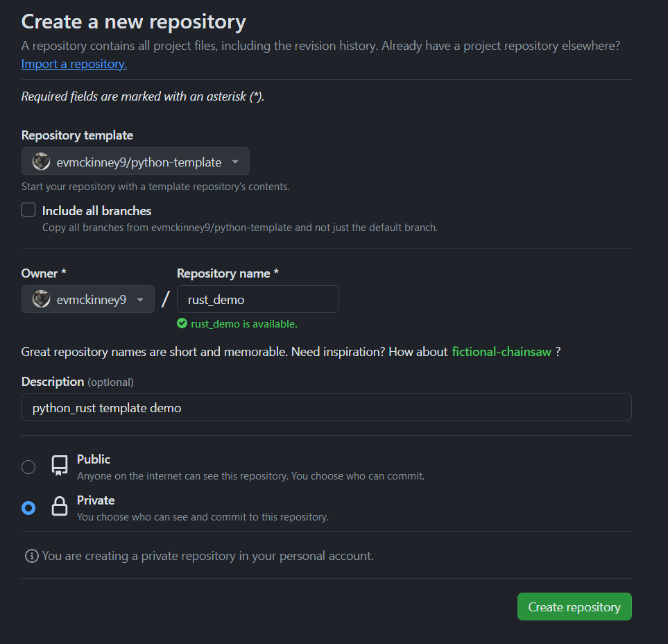
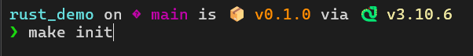
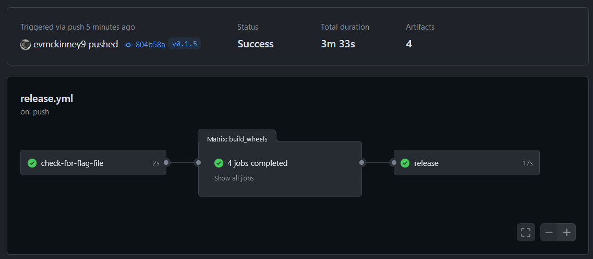
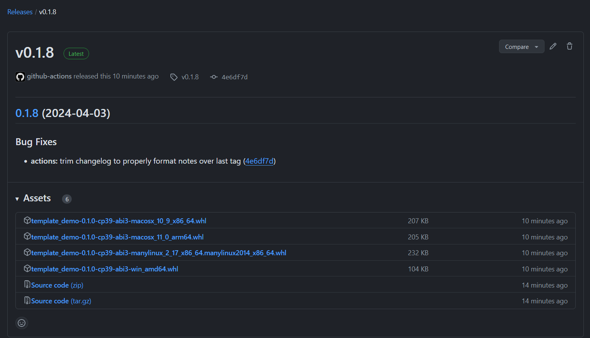

The goal of this post is to document the updates I made to my Python project template to **support creation of packages with integrated Rust that are installable via pip, without the need for a Rust compiler on the installation target**. Utilizing GitHub Actions and cibuildwheel, I automate the creation of wheels across multiple platforms. This process not only streamlines development workflows but also simplifies the distribution of Python packages that include Rust extensions.


Everything that follows has been implemented in my [Python project template](https://github.com/evmckinney9/python-template).

___

- **GitHub Actions**: Automates workflows, enabling CI/CD for project builds and tests. Learn more through [GitHub-hosted runners](https://docs.github.com/en/actions/using-github-hosted-runners/about-github-hosted-runners) and [building/testing Python](https://docs.github.com/en/actions/automating-builds-and-tests/building-and-testing-python).

- **Rust Learning**: Enhance your Rust knowledge with the [Rust Book](https://doc.rust-lang.org/stable/book/) and [Comprehensive Rust by Google](https://google.github.io/comprehensive-rust/). Practice with [Rustlings exercises](https://github.com/rust-lang/rustlings), and explore resources like [Awesome Rust](https://github.com/rust-unofficial/awesome-rust) and [Rust Algorithms](https://github.com/TheAlgorithms/Rust).

- **Rust and Python Integration**: Utilize [PyO3](https://pyo3.rs) for creating Python bindings for Rust code. [Maturin](https://www.maturin.rs/) is another tool for building Python packages from Rust extensions, although not used in this project. 
  - [`setuptools-rust`](https://github.com/PyO3/setuptools-rust) is an add-on for `setuptools` which is more flexibile but requires more configuration than `maturin`.
  - [Qiskit Accelerate](https://github.com/Qiskit/qiskit/tree/main/crates/accelerate), alongside its [performance insights](https://medium.com/qiskit/new-weve-started-using-rust-in-qiskit-for-better-performance-a3676433ca8c), illustrates the benefits of Rust and Python integration in a production environment.


# Setup Python with Rust

Start with a Python project template that's prepared for Rust integration. Refer to [PyO3's documentation](https://pyo3.rs) for instructions on wrapping Rust for Python, with the [setuptools-rust starter](https://github.com/PyO3/pyo3/tree/main/examples/setuptools-rust-starter) as a helpful resource.

## Modify Package Structure

1. **Update `pyproject.toml`**: Add `"setuptools_rust"` to the build system requirements, enabling Rust extension builds within your Python project. For detailed guidance, consult the [Setuptools Rust documentation](https://setuptools-rust.readthedocs.io/en/latest/).

    ```toml
    [build-system]
    requires = ["setuptools", "wheel", "setuptools-rust"]
    build-backend = "setuptools.build_meta"
    ```

    Also, define Rust extension modules here, as detailed in the [`RustExtension` API documentation](https://setuptools-rust.readthedocs.io/en/latest/reference.html).

    ```toml
    [[tool.setuptools-rust.ext-modules]]
    target = "{{project_name}}._accelerate"
    path = "crates/Cargo.toml"
    binding = "PyO3"
    ```

2. **Revise `MANIFEST.in`**: Update this file to include Rust source files in the package, ensuring a comprehensive package build. Guidance on which files to include can be found in the [Setuptools documentation](https://setuptools.pypa.io/en/latest/userguide/miscellaneous.html).

    ```ini
    include pyproject.toml
    include crates/Cargo.toml
    recursive-include crates *.rs
    recursive-include src *
    ```

3. **Detail `crates/Cargo.toml`**: This file specifies the Rust package's name, version, and dependencies. PyO3's inclusion facilitates Python bindings, as outlined in the [Cargo manifest format](https://doc.rust-lang.org/cargo/reference/manifest.html).

    ```toml
    [package]
    name = "{{project_name}}_accelerate"
    version = "0.1.0"
    edition = "2021"
    
    [lib]
    name = "{{project_name}}_accelerate"
    crate-type = ["cdylib"]
    path = "src/lib.rs"
    
    [dependencies.pyo3]
    version = "0.20.3"
    features = ["extension-module"]
    ```

## Define the Rust Functions
The process of integrating Rust functions into your Python project involves a few key steps:

1. **Implement Rust Functions**: Start by defining the Rust functions in `crates/src/basic_functions/basic_math.rs`. Utilize PyO3's `#[pyfunction]` attribute to ensure these functions are callable from Python.

    For example, to add and subtract in Rust:

    ```rust
    // crates/src/basic_functions/basic_math.rs
    use pyo3::prelude::*;

    #[pyfunction]
    #[pyo3(text_signature = "(a, b, /)")]
    pub fn add_in_rust(a: i32, b: i32) -> PyResult<i32> {
        Ok(a + b)
    }

    #[pyfunction]
    #[pyo3(text_signature = "(a, b, /)")]
    pub fn subtract_in_rust(a: i32, b: i32) -> PyResult<i32> {
        Ok(a - b)
    }
    ```

2. **Package Rust Functions into Modules**: Next, organize these functions into a module using `mod.rs`. This step groups your Rust functions logically, making them easier to manage and call from Python.

    ```rust
    // crates/src/basic_functions/mod.rs
    pub mod basic_math;
    pub mod basic_strings;

    use pyo3::prelude::*;

    #[pymodule]
    pub fn basic_functions(_py: Python, m: &PyModule) -> PyResult<()> {
        m.add_wrapped(wrap_pyfunction!(basic_math::add_in_rust))?;
        m.add_wrapped(wrap_pyfunction!(basic_math::subtract_in_rust))?;
        m.add_wrapped(wrap_pyfunction!(basic_strings::concat_in_rust))?;
        Ok(())
    }
    ```

3. **Expose Rust Modules to Python**: Finally, use `lib.rs` to expose the newly created modules to Python. This step ensures that the Rust-written functions are accessible within your Python environment.

    ```rust
    // crates/src/lib.rs

    use pyo3::prelude::*;
    use pyo3::wrap_pymodule;

    mod basic_functions;

    #[pymodule]
    fn _accelerate(_py: Python<'_>, m: &PyModule) -> PyResult<()> {
        m.add_wrapped(wrap_pymodule!(basic_functions::basic_functions))?;
        Ok(())
    }
    ```

## Testing the Template

Verifying the integration involves a straightforward process:

1. **Instantiate and Build**: After setting up the template and implementing the Rust functions, create a new repository from the template and clone it to your development environment. I use Ubuntu in WSL2, with Rust already installed.

      

2. **Build and Test**: Use the `make init` command to establish a virtual environment, install the project with all dependencies, and run tests to ensure successful integration.

    ```bash
    evmck@Desktop ~/template_demo
    $ make init
    ```

    Successful execution and interaction with the package methods can be confirmed in a Jupyter notebook, indicating the Rust functions are callable from Python.

    

::: {.callout-important}
Unsuprisingly, attempting to install the package on a Windows environment without Rust results in a build failure.

```{.bash code-line-numbers="false"}
evmck@Evan-Desktop ~/Downloads/windows_rust_demo
$ pip install -e git+https://github.com/evmckinney9/rust_demo#egg=rust_demo
```
The error encountered:

```{.text code-line-numbers="false"}
ERROR: Failed building editable for rust_demo
Failed to build rust_demo
ERROR: Could not build wheels for rust_demo, which is required to install pyproject.toml-based projects 
(.venv) 
```
This issue clarifies the importance of modifying the project's release strategy to enable distribution to machines without Rust.
:::

This standard project setup leaves us with a clean modular workspace ready for further development. The next steps involve building release workflows to distribute the package across multiple platforms.

# Distributing Wheels

GitHub Actions and cibuildwheel offer a robust solution for automating this process, allowing for the generation of wheels compatible with multiple platforms.
For more information about the GitHub Actions workflow, refer to the [official documentation](https://docs.github.com/en/actions) and [github-hosted runners](https://docs.github.com/en/actions/using-github-hosted-runners/about-github-hosted-runners).

## Building Wheels for Multiple Platforms

Set up a GitHub Action workflow to utilize cibuildwheel, facilitating the building of wheels. This setup covers Linux, macOS (both Intel and Apple Silicon), and Windows. For more information on cibuildwheel, refer to the [official documentation](https://cibuildwheel.pypa.io/en/stable/).

This [example](https://cibuildwheel.pypa.io/en/stable/setup/#github-actions) demonstrates how to set up GitHub Actions with cibuildwheel for building wheels across different operating systems.

```yaml
name: Build

on: [push, pull_request]

jobs:
  build_wheels:
    name: Build wheels on ${{ matrix.os }}
    runs-on: ${{ matrix.os }}
    strategy:
      matrix:
        # macos-13 is an intel runner, macos-14 is apple silicon
        os: [ubuntu-latest, windows-latest, macos-13, macos-14]

    steps:
      - uses: actions/checkout@v4

      - name: Build wheels
        uses: pypa/cibuildwheel@v2.17.0

	  - uses: actions/upload-artifact@v4
        with:
          name: cibw-wheels-${{ matrix.os }}-${{ strategy.job-index }}
          path: ./wheelhouse/*.whl
```

This YAML configuration automates the wheel building process, ensuring compatibility across different operating systems.

::: {.callout-note}
While Python and Rust are pre-installed on GitHub-hosted runners, Linux builds require additional configuration to include the Rust toolchain. Despite Rust [being pre-installed](https://github.com/actions/runner-images#available-images), because the build runs in a [container](https://github.com/pypa/manylinux), not on the host machine itself, we specify an [additional environment variables](https://github.com/pypa/cibuildwheel/issues/1684).

```yaml
env:
  CIBW_BEFORE_BUILD_LINUX: curl -sSf https://sh.rustup.rs | sh -s -- -y
  CIBW_ENVIRONMENT_LINUX: "PATH=$HOME/.cargo/bin:$PATH"
  CIBW_SKIP: "cp36-* cp37-* cp38-* cp39-* pp* *-win32 *-musllinux* *_i686"
```

Note, I also include `CIBW_SKIP`, necessary,... addressing known [compatibility issues](https://github.com/rust-lang/rustup/issues/2984).
:::

## Building Wheels for Multiple Python Versions

"By default, Python extension modules can only be used with the same Python version they were compiled against. The advantage of building extension modules using the limited Python API is that package vendors only need to build and distribute a single copy (for each OS / architecture), and users can install it on all Python versions from the minimum version and up."

Reference:
<https://pyo3.rs/v0.21.0/building-and-distribution.html>
<https://setuptools-rust.readthedocs.io/en/latest/building_wheels.html>

> Because `setuptools-rust` is an extension to `setuptools`, the standard [`python -m build`](https://pypa-build.readthedocs.io/en/stable/) command (or [`pip wheel --no-deps . --wheel-dir dist`](https://pip.pypa.io/en/stable/cli/pip_wheel/)) can be used to build distributable wheels. These wheels can be uploaded to PyPI using standard tools such as [twine](https://github.com/pypa/twine).

1. **Enable `abi3` in PyO3**: Adjust your `crates/Cargo.toml` to activate the `abi3` feature, ensuring compatibility across Python versions:

    ```toml
    [dependencies.pyo3]
    version = "0.20.3"
    features = ["extension-module", "abi3"]
    ```

2. **Mark Wheels as `abi3`**: Indicate the use of the limited API by configuring your `pyproject.toml`, which signals that the wheels are compatible with multiple Python versions starting from a specified minimum:

    ```toml
    [tool.distutils.bdist_wheel]
    py_limited_api = "cp39"
    ```

::: {.callout-warning}
(relevant closed issue: <https://github.com/PyO3/setuptools-rust/issues/399>). Note, the official documentation suggests using either setup.cfg or `DIST_EXTRA_CONFIG` environment variable. (I'm not entirely sure this is working still because I don't see this flag as I expect in the action logs.)
:::

## Generate Tagged Release Notes

Reference:

- conventional commits(<https://www.conventionalcommits.org>)
- angular commit convention (<https://github.com/angular/angular/blob/68a6a07/CONTRIBUTING.md#commit>)
- Popular tool is <https://github.com/vaab/gitchangelog>

Enforce conventional commits to automatically generate CHANGELOGs, and semantic versioning. but because I have already set up enforcement of using this commit-msg hook <https://github.com/qoomon/git-conventional-commits> there is a better way.

I use this tool <https://github.com/conventional-changelog/conventional-changelog> to build the changelog notes. This tool is intended to work by generating the release notes before the tagged commitbut because I use the tagged commit to trigger this action I need to do something a bit messy.

Specify `-r 2` to get the last two releases (the most recent commit is from HEAD ahead of the last tagged commit, but I really want the second one). Then trim the first two lines of this file to remove the junk notes.

```yaml
- name: Generate Changelog
run: |
  npm install -g conventional-changelog-cli
  conventional-changelog -p angular -r 1 > temp_changelog.md
  echo "$(cat temp_changelog.md CHANGELOG.md)" > CHANGELOG.md

- name: Commit changes and push back to GitHub
uses: stefanzweifel/git-auto-commit-action@v4
with:
  commit_message: "docs(changelog): update CHANGELOG.md for release"
  file_pattern: CHANGELOG.md
  branch: main
```

I make this separation because on the release, I can link the path for the release notes to be the output for the last tag while still maintaining a separate file for all changes.

GH-release action (<https://github.com/marketplace/actions/gh-release>)

```yaml
- name: Create Release
uses: softprops/action-gh-release@v2
with:
  files: ./wheelhouse/*.whl
  body_path: temp_changelog.md
env:
  GITHUB_TOKEN: '${{ secrets.GITHUB_TOKEN }}'
```

I'll also highlight Google's release-please action, <https://github.com/googleapis/release-please,> which generates release PRs based on conventional commits. This could be a good option; however, python repositories must have a `setup.py` and `setup.cfg` to work.

This is also a good option, but this will only generate release notes based on merged pull requests instead of by commits. This is in some ways better - but my repositories do not necessarily enforce branch protection rules, which means you can directly commit to `main`.

<https://docs.github.com/en/repositories/releasing-projects-on-github/automatically-generated-release-notes#about-automatically-generated-release-notes>

# Part 3. Putting it All together

Here are two example projects that use cibuildwheel with setuptools_rust

1. <https://github.com/daggy1234/polaroid/blob/main/.github/workflows/publish.yml>
2. <https://github.com/etesync/etebase-py/blob/master/.github/workflows/manual.yml>

Here is the file from the template repository:
https://github.com/evmckinney9/python-template/blob/main/.github/workflows/release.yml

```yaml
name: CI

on: # triggered by push tagged commits to main
  push:
    tags:
      - 'v*'

permissions:
  contents: write

jobs:
  check-for-flag-file:
    if: github.repository != 'evmckinney9/python-template'
    runs-on: ubuntu-latest
    outputs:
      continue: ${{ steps.flag-check.outputs.continue }}
    steps:
      - uses: actions/checkout@v4
      - name: Check for template_flag.yml
        id: flag-check
        run: |
          if [ ! -f .github/template_flag.yml ]; then
            echo "continue=true" >> $GITHUB_OUTPUT
          else
            echo "continue=false" >> $GITHUB_OUTPUT
          fi

  build_wheels:
    needs: check-for-flag-file
    if: needs.check-for-flag-file.outputs.continue == 'true'
    name: 'Build wheels on ${{ matrix.os }}'
    runs-on: '${{ matrix.os }}'
    strategy:
      matrix:
        os:
          - ubuntu-latest
          - windows-latest
          - macos-13
          - macos-14
    env:
      CIBW_BEFORE_BUILD_LINUX: curl -sSf https://sh.rustup.rs | sh -s -- -y
      CIBW_ENVIRONMENT_LINUX: "PATH=$HOME/.cargo/bin:$PATH"
      CIBW_SKIP: "cp36-* cp37-* cp38-* cp39-* pp* *-win32 *-musllinux* *_i686"

    steps:

      - uses: actions/checkout@v4
      - name: Check if template_flag.yml is gone
        id: check-template
        if: ${{ hashFiles('.github/template_flag.yml') == '' }}
        run: |
          echo "release_continue=true" >> $GITHUB_ENV

      - name: Build wheels
        uses: pypa/cibuildwheel@v2.17.0
      - uses: actions/upload-artifact@v4
        with:
          name: 'cibw-wheels-${{ matrix.os }}-${{ strategy.job-index }}'
          path: ./wheelhouse/*.whl
  release:
    needs: [check-for-flag-file, build_wheels]
    if: needs.check-for-flag-file.outputs.continue == 'true'
    runs-on: ubuntu-latest
    steps:
      - name: Check out the repo
        uses: actions/checkout@v4
        with:
          fetch-depth: 0

      - uses: actions/checkout@v4
      - name: Check for initial commit condition and exit if true
        run: |
          if [ -f .github/template_flag.yml ]; then
            echo "Initial commit setup detected, exitting."
            exit 0
          fi
      - name: Set up Node.js
        uses: actions/setup-node@v4

      - name: Generate Changelog
        run: |
          npm install -g conventional-changelog-cli
          conventional-changelog -p conventionalcommits -r 2 | tail -n +3 > CHANGELOG.tmp

      - uses: actions/download-artifact@v4
        with:
          path: ./wheelhouse

      - name: Create Release
        uses: softprops/action-gh-release@v2
        with:
          files: ./wheelhouse/**/*.whl
          body_path: CHANGELOG.tmp
        env:
          GITHUB_TOKEN: '${{ secrets.GITHUB_TOKEN }}'
```

## Verification

Let's make sure using the template now works. Can I commit a change, create a release, and pip install on windows (with no rust) and on a lower python version.

  

and after some tweaking got this working

  

Let's try installing again. Instead of

```bash
pip install -e git+https://github.com/evmckinney9/template_demo#egg=template_demo
```

I'll directly install the wheel file from the latest release.

```bash
pip install https://github.com/evmckinney9/template_demo/releases/download/v0.2.0/template_demo-0.1.0-cp39-abi3-win_amd64.whl
```

Success!! The `template_demo` package was successfully installed - and I could run the rust methods from `_accelerate` even though I never installed Rust on my windows machine.

## Next Steps

- Dockerfile or Containerfile -> make it easier to reproduce experiments
- Remove hardcoding of python-version across multiple files. Use a .py-version file?
- Improve version bumping. Enforce semantic versioning and something that updates the pyproject.toml file
- generate documentation (sphinx, mkdocs, pdocs) Want something simple and integrates best with my existing documentation style (google docstrings)
- Find a setup for debugging template actions. Current approach is update template -> clone template -> commit to trigger action -> observe what happens. Can I trigger actions in a more controlled manner before having to push changes back to github?
